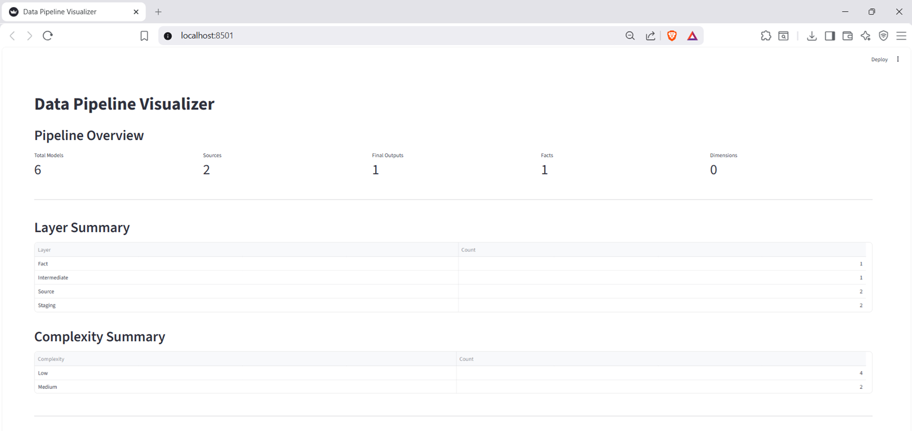
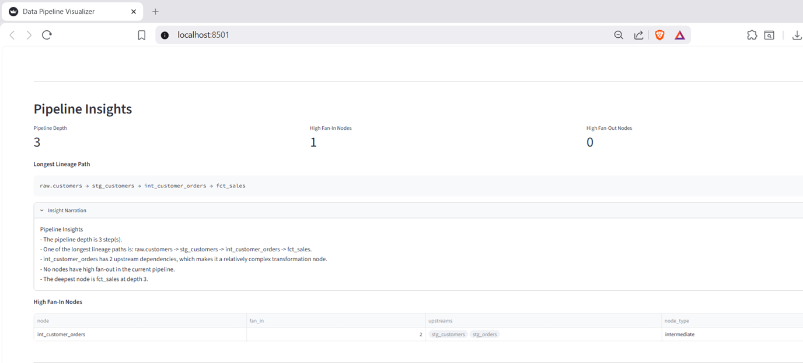
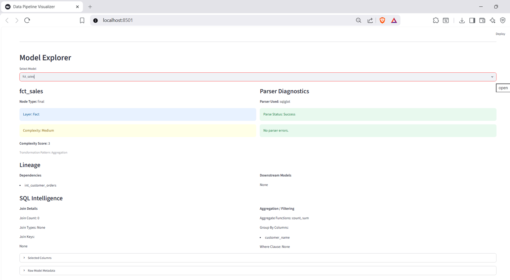

# Data Pipeline Visualizer

A Python-based SQL Intelligence and Data Lineage platform that extracts dependencies from SQL/dbt-style models, builds lineage graphs, analyzes transformation complexity, generates documentation, and provides an interactive Streamlit dashboard.

## Overview

Data Pipeline Visualizer helps data engineers and architects understand how data moves through SQL-based transformation pipelines.

### Key Capabilities

- SQL dependency extraction
- dbt `ref()` support
- DAG generation and visualization
- SQL intelligence (joins, aggregations, filters)
- Complexity scoring
- Layer classification
- Pipeline insights
- Model catalog generation
- Per-model documentation
- Streamlit dashboard

## Architecture

```text
SQL Models
    ↓
Dependency Extraction
    ↓
SQL Intelligence
    ↓
Lineage Graph
    ↓
Insights Engine
    ↓
Metadata Catalog
    ↓
Reports & Documentation
    ↓
Streamlit Dashboard
```

## Technology Stack

- Python 3.11+
- NetworkX
- Graphviz
- SQLGlot
- Streamlit
- Pandas
- Pytest
- Ruff

## Features

### Lineage Analysis
- Dependency extraction
- DAG generation
- Topological ordering
- Cycle detection

### SQL Intelligence
- Join detection
- Join key extraction
- Aggregation detection
- Filter analysis
- Transformation pattern classification

### Insights
- Pipeline depth
- Fan-in analysis
- Fan-out analysis
- Bottleneck detection
- Complexity scoring

### Catalog & Documentation
- Model catalog export
- Layer classification
- Markdown documentation generation
- Pipeline reports

## Running

Generate lineage and reports:

```bash
python -m app.main models --parser auto
```

Launch dashboard:

```bash
streamlit run app/ui.py
```

## Outputs

```text
output/
├── pipeline_dag.png
├── pipeline_report.md
├── graph_data.json
├── model_catalog.json
└── catalog/
```
## Dashboard Overview



## Pipeline Insights



## Model Explorer



## Future Enhancements

- Column-level lineage
- Interactive DAG visualization
- dbt manifest ingestion
- Snowflake-specific parsing
- Databricks-specific parsing
- AI-generated documentation

---

## Author
Virendra Pratap Singh
https://www.linkedin.com/in/virendra-pratap-singh-iitg/
### NVA Dataworks
Built as a portfolio project to demonstrate data pipeline architecture and visualization concepts.
